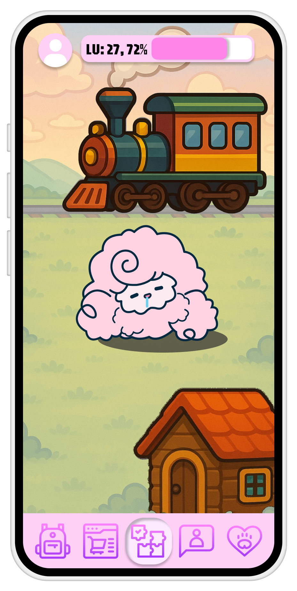
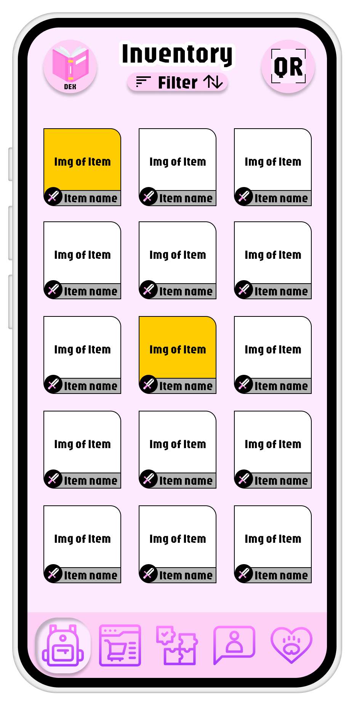

# Powapong (Flutter Edition)

**Powapong은** 포아미를 비롯한 귀여운 동물 친구들과 함께 퍼즐을 풀고 적을 물리치는 *모험형 퍼즐 RPG 게임*입니다.

핑크톤의 아기자기한 UI, 캐릭터 수집, 성장, 아이템 사용 등 다양한 RPG 요소가 결합된 모바일 게임입니다.





---

## 🎮 게임 소개

- **장르**: 퍼즐 기반 캐주얼 RPG
- **플랫폼**: Android / iOS (Flutter 기반)
- **그래픽 스타일**: 핑크톤, 감성적이고 귀여운 디자인
- **주요 콘텐츠**:
  - 매치 퍼즐과 연동된 실시간 전투
  - 귀여운 동물형 캐릭터 수집 및 성장
  - 아이템 장착/사용 및 인벤토리 관리
  - 스테이지 및 최종 보스전 구성
  - QR 연동, 필터링 가능한 인벤토리 UI

---

## 🧩 주요 기능

| 기능             | 설명                                                                                    |
| ---------------- | --------------------------------------------------------------------------------------- |
| 퍼즐 보드 시스템 | 매치-3 퍼즐 기반 전투                                                                   |
| RPG 전투         | 속성, 스킬, HP 등 전투 계산                                                             |
| 인벤토리 시스템  | 아이템 획득, 장착, 필터링 UI                                                            |
| 캐릭터 성장      | 경험치, 특성, 스킬 강화 시스템                                                          |
| UI/UX 디자인     | 부드러운 색상 기반의 직관적 인터페이스                                                  |
| QR 기능          | QR 코드로 아이템 수집 가능                                                              |
| 추첨 기능        | 매주 각 리그마다 특정 스코어를 달성한 인원 중 일부에<br />포와포와의 건강기능식품 증정! |

---

## 🛠 기술 스택

| 영역                     | 스택                                     |
| ------------------------ | ---------------------------------------- |
| **프레임워크**           | Flutter (3.x 이상)                       |
| **언어**                 | Dart                                     |
| **UI 시스템**            | Flutter 위젯, CustomPainter, 패키지 활용 |
| **상태 관리**            | Provider, Riverpod, Bloc 등              |
| **애니메이션**           | Flutter Animation, Rive, Lottie          |
| **데이터 관리**          | JSON, SharedPreferences, SQLite          |
| **오디오**               | audioplayers, just_audio 등              |
| **클라우드 연동 (예정)** | Firebase, Google Cloud                   |
| **출시 플랫폼**          | Android / iOS (Flutter build, CI/CD)     |

---

## 📁 프로젝트 구조 (예시)

```plaintext
lib/
├── main.dart                # 앱 진입점
├── screens/                 # 주요 화면 (메인, 인벤토리, 전투 등)
├── widgets/                 # 공통 위젯, 커스텀 UI 컴포넌트
├── models/                  # 데이터 모델 (캐릭터, 아이템 등)
├── providers/               # 상태 관리 (Provider/Riverpod 등)
├── services/                # 데이터, 네트워크, 오디오 등 서비스
├── assets/                  # 이미지, 사운드, 폰트 등 리소스
└── utils/                   # 유틸리티 함수, 헬퍼
```

---

## 🚀 출시 계획

1. **MVP 개발중** (퍼즐 + 전투 + 기본 UI)
2. **실기기 테스트 (Android/iOS, 에뮬레이터 및 실기기)**
3. **스토어 준비 및 심사**
4. **Google Play / App Store 출시**
5. **정기 업데이트: 스테이지 추가, 이벤트, 아이템 확장 등**

---

## 📝 라이선스

**본 프로젝트는 (주)알루스 헬스케어의 프로젝트이며, 2차 사용 및 복제를 금지합니다.**

---

## 📫 문의

- 제작자: 김동욱
- 연락처: dwkim@alus.kr
- 인스타그램: @powapowa_official
